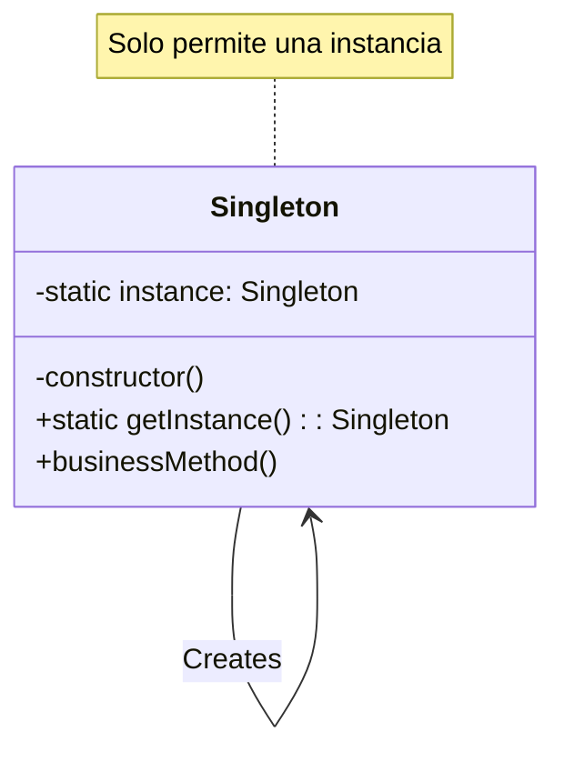

# Documentación Técnica: Patrón Singleton en TypeScript

## CONTEXTO Y FUNDAMENTOS

### Descripción del Patrón
El patrón Singleton es un patrón de diseño creacional que asegura que una clase tenga una única instancia y proporciona un punto de acceso global a ella. Este patrón es fundamental cuando necesitamos coordinar acciones en todo el sistema a través de un único punto de control.

### Propósito y Casos de Uso
El propósito principal es controlar el acceso a recursos compartidos, como conexiones a bases de datos, configuraciones del sistema o cachés. Por ejemplo, en una aplicación bancaria, el sistema de logging de transacciones debe ser único para mantener la consistencia y trazabilidad de las operaciones.

### Problema que Resuelve
En sistemas complejos, múltiples instancias de ciertos componentes pueden generar inconsistencias, consumo innecesario de recursos y comportamientos impredecibles. El Singleton resuelve esto garantizando una única instancia controlada.

### Solución Propuesta
La solución se estructura mediante:
- Constructor privado que previene la instanciación directa
- Variable estática privada que almacena la única instancia
- Método estático público que controla el acceso a la instancia




## COMPRENSIÓN Y APLICABILIDAD

### Analogía Práctica
Imagine una empresa con un único director general. Independientemente de quién necesite tomar decisiones ejecutivas, todas las solicitudes deben pasar por esta única persona autorizada. De manera similar, el Singleton proporciona un único punto de decisión y control.

### Escenarios de Uso Apropiado
- Gestión de conexiones a bases de datos
- Sistemas de configuración global
- Servicios de logging
- Gestores de caché
- Pools de recursos compartidos

### Criterios de Implementación
Se debe implementar cuando:
- Se requiere exactamente una instancia de una clase
- Se necesita un acceso controlado desde múltiples puntos
- Se debe garantizar la consistencia del estado global

No se recomienda cuando:
- El componente no necesita mantener estado
- Se requiere flexibilidad en el número de instancias
- Se busca una alta cohesión y bajo acoplamiento

## IMPLEMENTACIÓN Y EJEMPLOS

### Ejemplo Práctico: Sistema de Logging Bancario

#### Descripción
Implementaremos un sistema de logging para transacciones bancarias que debe mantener un registro consistente y centralizado de todas las operaciones.

#### Código Sin Patrón

```typescript
class TransactionLogger {
    private logFile: string;

    constructor() {
        this.logFile = 'transactions.log';
    }

    public logTransaction(transaction: {id: string, amount: number, type: string}) {
        const logEntry = `${new Date().toISOString()} - ID: ${transaction.id} - ${transaction.type} - $${transaction.amount}`;
        console.log(`Logging to ${this.logFile}: ${logEntry}`);
    }
}

// Uso problemático
const logger1 = new TransactionLogger();
const logger2 = new TransactionLogger();
// Múltiples instancias pueden causar problemas de consistencia
```

#### Implementación con Singleton


```typescript
class TransactionLogger {
    private static instance: TransactionLogger | null = null;
    private logFile: string;
    private constructor() {
        this.logFile = 'transactions.log';
        this.initializeLogger();
    }

    private initializeLogger(): void {
        // Simulación de inicialización de recursos
        console.log(`Initializing logger with file: ${this.logFile}`);
    }

    public static getInstance(): TransactionLogger {
        if (!TransactionLogger.instance) {
            TransactionLogger.instance = new TransactionLogger();
        }
        return TransactionLogger.instance;
    }

    public logTransaction(transaction: {
        id: string,
        amount: number,
        type: string
    }): void {
        const logEntry = `${new Date().toISOString()} - ID: ${transaction.id} - ${transaction.type} - $${transaction.amount}`;
        console.log(`Logging to ${this.logFile}: ${logEntry}`);
    }

    // Método para testing
    public getLogFile(): string {
        return this.logFile;
    }
}

// Ejemplo de uso
const logger = TransactionLogger.getInstance();
logger.logTransaction({
    id: "TX123",
    amount: 1000,
    type: "DEPOSIT"
});

// Intento de crear otra instancia - retornará la misma
const anotherLogger = TransactionLogger.getInstance();
console.log(logger === anotherLogger); // true

```

### Explicación de Cambios y Beneficios
Los cambios principales incluyen:
1. Constructor privado que previene la creación directa de instancias
2. Variable estática privada para almacenar la única instancia
3. Método estático público getInstance() para acceso controlado
4. Inicialización lazy-loading que optimiza recursos

## EVALUACIÓN CRÍTICA

### Beneficios
1. Garantiza una única instancia global
2. Optimiza el uso de recursos del sistema
3. Proporciona un punto de acceso consistente
4. Facilita el control de acceso concurrente

### Limitaciones
1. Introduce un estado global que puede dificultar el testing
2. Puede crear acoplamiento fuerte entre componentes
3. Complica la herencia y extensibilidad
4. Puede dificultar la concurrencia si no se implementa correctamente

### Comparación con Alternativas
- Dependency Injection: Más flexible pero requiere más configuración
- Static Class: Más simple pero menos controlable
- Factory Method: Más versátil pero no garantiza instancia única

### Recomendaciones de Mitigación
1. Implementar interfaces para reducir el acoplamiento
2. Utilizar lazy initialization para optimizar recursos
3. Considerar aspectos de concurrencia en la implementación
4. Mantener la responsabilidad única del Singleton
5. Documentar claramente el propósito y uso del patrón
